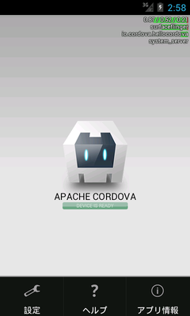

# CordovaNativeMenu

PhoneGap(Cordova)にAndroidネイティブのメニューを実装するパーツです。今のところAndroid専用なのでiOSプロジェクトには対応していません。

使用にはNode.jsとnpmモジュールの[dom-js](https://github.com/teknopaul/dom-js)が必要です。

## 使用方法

1. Node.jsをインストール後、npmモジュールのdom-jsをグローバルインストールします。

        $ npm install -g dom-js

2. `native-menu.json.example`を参考に、PhoneGap(Cordova)プロジェクトのrootに`native-menu.json`を作成します。

3. `hooks`ディレクトリの中身をPhoneGap(Cordova)プロジェクトのrootにある`hooks`ディレクトリにコピーします。

4. `phonegap build`コマンドや`cordova build`コマンドでプロジェクトをビルドして作成したアプリを実行してメニューボタンを押すとネイティブメニューが表示されるようになります(`run`コマンドでは`hooks`のスクリプトが走らないので、メニューを新規作成したり変更した後の初回は必ず`build`コマンドを実行してください)。

## 仕組み

PhoneGap(Cordova)プロジェクトの`hooks`ディレクトリに実行可能ファイルを置いておくと様々なタイミングでそのファイルを実行してくれます。今回の例で言うとプロジェクトのビルド直前に`before_build`ディレクトリの`native-menu.js`が実行されるようになります。

`native-menu.js`では`platforms/android/src/アプリのメインソース`に動的にメニューを作成するコードを書き加える処理と、メニューに表示される項目の内容を記述した`menu.xml`を`platforms/android/res/menu`ディレクトリに作成します。その際にプロジェクトのrootに置いた`native-menu.json`を読み込んでメニュー内容を取得します。

__メインソースの内容を正規表現を使用して直接書き換えるという割と危険な事をしています。場合によってはメインソースを壊してしまうかもしれません。何回か実行して問題がないことを確認できるまではメインソースのバックアップを取っておいてから実行してください。__

## native-menu.jsonの内容

以下の3項目でメニュー項目1つ分となります。それを配列で指定してください。

* id

    どのメニュー項目が選択されたのかをJavaScript側のイベントで判定するための識別子です。各メニュー項目で重複しないようにしてください。

* title

    メニューに表示される文字列です。

* icon

    メニューに表示されるアイコンファイル名です。ここで指定したファイル名と同名のPNGアイコンファイルを`platforms/android/res/drawable`ディレクトリに置いてください。
    
    例) `ic_menu_help`と指定した場合は`platforms/android/res/drawable/ic_menu_help.png`がメニューアイコンとして使用される。

    また、`platforms/android/res/drawable`にアイコンを置いていない場合はAndroidデフォルトのリソースに該当するアイコンがあるかチェックして、あればそれを使用します。
    
    デフォルトのメニューリソースIDは[こちら](http://androiddrawables.com/Menu.html)を参照してください(ただし、機種のメーカーによってアイコンがあったりなかったりするようなのでPNGファイルを自前で用意した方が安全と思われます)。

## メニュー項目を選択した時のイベントのJavaScript側での受け取り方

`optionselect`イベントが発生するので、その中で引数で渡されたeventオブジェクトの`itemId`を参照すると`native-menu.json`で指定したidが入っています。

    document.addEventListener('optionselect', function (event) {
      if (event.itemId === 'help') {
        ...
      }
    });

## 対応バージョン

PhoneGap3.4.0での動作を確認しています。それ以下のバージョンでは正常に動作しない可能性があります。

__※PhoneGap3.3と3.4ではディレクトリ構成も変わっているようなので3.3でも正常に動かないかもしれません。__

## Changelog

### 0.1.0 (2014-04-23)

* 初版リリース

## ライセンス

[MIT license](http://www.opensource.org/licenses/mit-license)で配布します。

&copy; 2014 [ktty1220](mailto:ktty1220@gmail.com)
